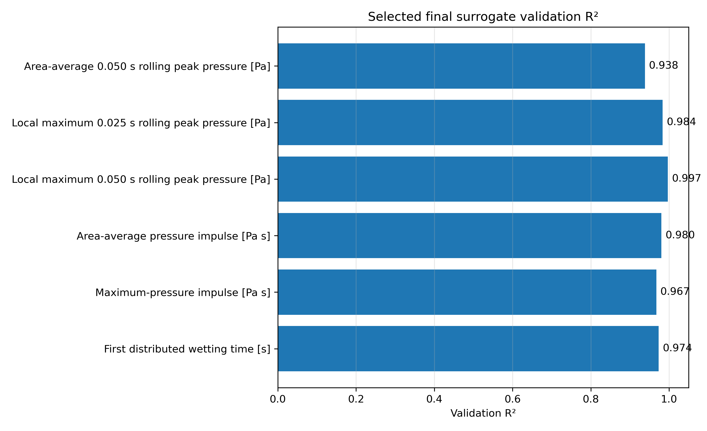
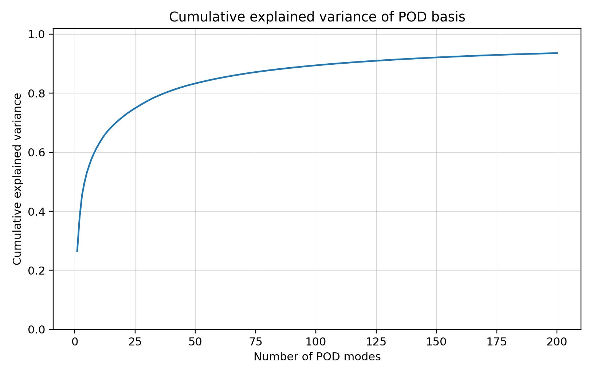

# Automated OpenFOAM VOF Simulation and Surrogate Modelling of Dam-Break Impact Loads on an Obstacle


A CFD and data-driven surrogate modelling study. Starting from the standard OpenFOAM `interFoam` laminar dam-break tutorial, this project builds a fully automated 403-case VOF simulation database, extracts robust impact-pressure and wetting metrics, trains scalar surrogate models for design-space exploration, and develops a POD reduced-order field surrogate for free-surface reconstruction on unseen validation cases.

---

## Problem

A dam-break releases a column of water that accelerates across a channel floor and impacts an obstacle. The transient hydraulic load on the obstacle — peak pressure, pressure impulse, and wetting time — depends on the geometry of the water column and the obstacle. The goal is to map this dependence efficiently using high-fidelity CFD data and surrogate models.

**Physics:** two-phase water–air flow, gravity-driven, solved with the VOF method (`alpha.water` volume fraction).  
**Solver:** OpenFOAM `interFoam`, laminar, 2-D.  
**End time:** 1.5 s per simulation.

---

## Governing Equations

The `interFoam` solver uses a Volume of Fluid (VOF) method to track the water–air interface.

**Volume fraction transport**

$$\frac{\partial \alpha}{\partial t} + \nabla \cdot (\alpha \mathbf{U}) + \nabla \cdot \left[\alpha(1-\alpha)\mathbf{U}_r\right] = 0$$

The third term is the interface-compression term that keeps the interface sharp without explicit reconstruction. $\mathbf{U}_r$ is active only where $\alpha(1-\alpha) \neq 0$.

**Mixture properties**

$$\rho = \alpha\rho_w + (1-\alpha)\rho_a \qquad \mu = \alpha\mu_w + (1-\alpha)\mu_a$$

**Continuity**

$$\nabla \cdot \mathbf{U} = 0$$

**Momentum**

$$\frac{\partial (\rho \mathbf{U})}{\partial t} + \nabla \cdot (\rho \mathbf{U} \otimes \mathbf{U}) = -\nabla p + \nabla \cdot \left[\mu \left(\nabla \mathbf{U} + \nabla \mathbf{U}^T\right)\right] + \rho \mathbf{g} + \mathbf{f}_\sigma$$

**Surface tension force** (Continuum Surface Force model, Brackbill et al. 1992)

$$\mathbf{f}_\sigma = \sigma \kappa \nabla \alpha$$

**OpenFOAM modified pressure**

$$p_{rgh} = p - \rho \mathbf{g} \cdot \mathbf{x}$$

$p_{rgh}$ subtracts the hydrostatic contribution, improving solver conditioning. $\alpha$: water volume fraction; $\mathbf{U}$: velocity; $\rho$: mixture density; $\mu$: dynamic viscosity; $\sigma$: surface tension coefficient; $\kappa$: interface curvature; $\mathbf{g}$: gravity; $\mathbf{x}$: position vector.

---

## Parameter Space

Three geometric parameters were varied. Obstacle width was fixed.

| Parameter | Symbol | Range |
|---|---|---|
| Initial water-column height | H | varied |
| Obstacle height | h | varied |
| Obstacle front position | x | varied |

**343 structured training cases** were generated on a regular grid using a design-of-experiments approach.  
**60 off-grid validation cases** were sampled with Latin hypercube sampling (LHS) and held out completely from training.

---

## Workflow

1. **Case generation** — automated OpenFOAM case setup from parameter combinations (`generate_surrogate_database_cases.py`)
2. **Simulation** — 403 `interFoam` VOF runs, fields written every 0.025 s, function-object data every 0.005 s (`run_surrogate_database_all.sh`)
3. **Metric extraction** — obstacle pressure history (area-average and point-maximum), pressure impulse, and distributed wetting time extracted per case (`extract_surrogate_database_metrics.py`, `compute_robust_peak_metrics.py`)
4. **Scalar surrogate training** — ten model families tried per target; best selected by validation nRMSE on the 60 unseen cases (`train_robust_surrogate_models.py`)
5. **Field dataset assembly** — `alpha.water` fields interpolated onto a common 96 × 96 grid and stored as a memory-mapped array (`build_alpha_field_surrogate_dataset.py`)
6. **POD field surrogate** — 200-mode incremental PCA trained on 20 923 training snapshots; one KNN coefficient regressor per saved time slice (`train_alpha_pod_timeslice_surrogate_200m.py`)
7. **Validation** — all surrogate models evaluated on 60 unseen cases / 3 660 unseen snapshots
8. **Visualisation** — response-surface plots, parity plots, GIFs (`plot_final_surrogate_response_surfaces.py`, `make_final_showcase_alpha_surrogate_gif_200m.py`, `make_response_surface_gifs.py`, `make_best_design_explorer_gifs.py`)

---

## Scalar Surrogate Results

Robust time-aggregated metrics are strong surrogate targets. Raw instantaneous peak pressure was not pursued as a primary target — it is controlled by short-duration transient events and is inherently difficult to predict with a global scalar surrogate.

| Target | Model | Validation R² | Validation nRMSE |
|---|---|---|---|
| Local max 0.050 s rolling peak pressure | poly3 ridge | **0.997** | 1.49% |
| Local max 0.025 s rolling peak pressure | poly3 ridge | **0.984** | 3.22% |
| Area-average pressure impulse | poly3 ridge | **0.980** | 3.67% |
| Maximum-pressure impulse | KNN | **0.967** | 4.15% |
| First distributed wetting time | Gaussian process | **0.974** | 5.29% |
| Area-average 0.050 s rolling peak pressure | RBF SVR | **0.938** | 6.17% |

Validation is on 60 off-grid LHS cases, held out from all training.



---

## POD Field Surrogate

`alpha.water` free-surface fields were reconstructed using a time-sliced POD (proper orthogonal decomposition) surrogate trained on 20 923 snapshots from 343 cases and validated on 3 660 snapshots from 60 unseen cases.

| Metric | Value |
|---|---|
| POD modes | 200 |
| Common grid | 96 × 96 |
| POD explained variance (200 modes) | 93.6% |
| Mean validation RMSE in α | 0.091 |
| Mean validation MAE in α | 0.029 |
| Mean phase-mask IoU | 0.851 |
| Mean interface-front MAE | 0.084 m |
| Mean relative water-volume error | 1.8% |



The POD surrogate captures the dominant free-surface evolution but is an approximate reduced-order reconstruction, not a CFD replacement. Sharp moving VOF interfaces are difficult to reconstruct exactly with a linear POD basis — the error panel in the GIF above shows this honestly.

---

## Key Outputs

| File | Description |
|---|---|
| `results/final_project_outputs/gifs/FINAL_cfd_vs_pod_surrogate_alpha_field.gif` | CFD vs POD surrogate free-surface reconstruction (unseen validation case) |
| `results/final_project_outputs/gifs/surrogate_response_surface_dashboard.gif` | Surrogate response surfaces across obstacle positions |
| `results/final_project_outputs/gifs/surrogate_best_design_explorer.gif` | Surrogate-guided best-design explorer |
| `results/final_project_outputs/figures/` | Validation R², nRMSE, POD variance, RMSE distribution plots |

---

## Repository Structure

```
scripts/                          Python scripts for the full pipeline
results/
  final_project_outputs/          Curated figures, GIFs, and summary CSVs
  surrogate_database/
    metrics/                      Extracted CFD metrics per case
    robust_metrics/               Robust time-aggregated impact metrics
    robust_surrogate_models/      Trained scalar surrogate model artefacts
    field_surrogate/              POD model files and snapshot dataset
    final_surrogate_plots/        Response surface contour plots
    media/                        GIFs and frames
parametric_study/
  surrogate_database_cases/       403 OpenFOAM case directories (~27 GB, not tracked)
```

> The 27 GB simulation database (`surrogate_database_cases/`) and the alpha-field snapshot memmap are excluded from version control.

---

## Tech Stack

- **CFD:** OpenFOAM `interFoam` (VOF, two-phase)
- **Surrogate models:** scikit-learn — polynomial ridge regression, RBF SVR, KNN, Gaussian process, ExtraTrees, random forest, gradient boosting
- **POD / dimensionality reduction:** scikit-learn `IncrementalPCA`
- **Numerics:** NumPy, SciPy
- **Visualisation:** Matplotlib, Pillow
- **Automation:** Python, Bash

---

## Future Work

Future work will focus on improving the field surrogate using local POD, Gaussian-process coefficient models, or nonlinear autoencoder-based reconstruction, while keeping the workflow physically interpretable and validated against CFD.
